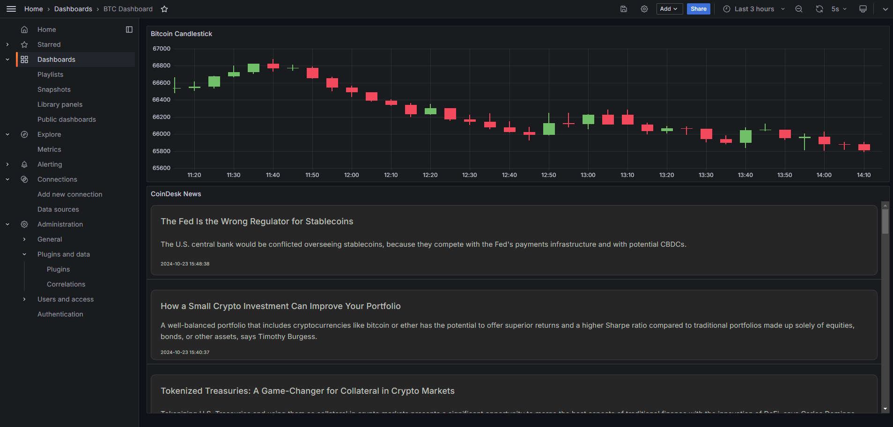

# crypto-monitor
A real-time monitoring project that combines cryptocurrency prices with key crypto news.

CryptoMonitor uses:

Websockets to connect to the Binance API and receive real-time updates on Bitcoin (BTC) prices.
Web scraping to fetch relevant news directly from CoinDesk, keeping you informed of the latest events that could impact the market.

Technologies Used
- Python: Main programming language.
- WebSocket API: For real-time data streaming from Binance.
- Requests: For scraping news from CoinDesk.
- Kafka:
  - The scraped news is sent through a Kafka topic.
  - A Kafka consumer receives the news, stores it in a database, and generates an RSS feed to show in Grafana.
  - Protobuf is used for efficient encoding.
- RSS: To handle news.
- Grafana - Prometheus: Handle and show btc timeseries and news.
- Postgres: As DB.

Grafana View

